<div align="center">

<!-- Animated Banner -->


<!-- Tech Stack Badges -->
<p>
  
  
  
  
</p>

<!-- Status Badges -->
<p>
  
  
  
</p>

<br/>

> ### 🎯 *Real-time Emergency Response Management System*
> **AI-powered dispatch platform that transforms emergency calls into actionable intelligence**

<br/>

<!-- Dashboard Preview -->


<br/><br/>

---

<!-- Full Stack Navigation -->
## 🔗 Explore The Ecosystem

<table>
<tr>
<td align="center" width="50%">

<br/><br/>
<code>React • TypeScript • Vite</code>
<br/>
<sub>✨ Tactical Dashboard & Live UI</sub>
</td>
<td align="center" width="50%">
<a href="https://github.com/sanjayrohith/ResQ-Backend">

</a>
<br/><br/>
<code>FastAPI • AI/NLP • Python</code>
<br/>
<sub>🔥 AI Engine & Command Center</sub>
</td>
</tr>
</table>

---

<!-- Meet The Team Section -->
## 👨‍💻 The Architects

<table>
<tr>
<td align="center" width="33%">
<a href="https://github.com/sanjayrohith">

<br/><br/>
<strong>Sanjay Rohith</strong>
<br/>
<sub>🚀 Lead Developer</sub>
<br/><br/>

</a>
</td>
<td align="center" width="33%">
<a href="https://github.com/sanjayy0612">

<br/><br/>
<strong>Sanjay E</strong>
<br/>
<sub>🧠 AI & Backend</sub>
<br/><br/>

</a>
</td>
<td align="center" width="33%">
<a href="https://github.com/AbishekRaj2007">

<br/><br/>
<strong>Abishek Raj</strong>
<br/>
<sub>🎨 Frontend Architect</sub>
<br/><br/>

</a>
</td>
</tr>
</table>

</div>

---

<br/>

## 💡 The Problem We're Solving

<table>
<tr>
<td>

### ⏱️ Every Second Matters

Emergency dispatchers are the **unsung heroes** operating under extreme pressure:

| Challenge | Impact |
|-----------|--------|
| 📝 **Manual Data Entry** | Precious seconds wasted during high-stress calls |
| ❌ **Human Error** | Incorrect resource deployment risks lives |
| 🧠 **Cognitive Overload** | Managing multiple streams simultaneously |
| 🐌 **Delayed Response** | Inefficient incident classification |

</td>
<td width="40%">

```
    ┌──────────────────┐
    │   BEFORE ResQ    │
    │                  │
    │   📞 ──→ 📝     │
    │   Call   Manual  │
    │          Entry   │
    │                  │
    │   ⏰ +45 seconds │
    └──────────────────┘

    ┌──────────────────┐
    │   WITH ResQ-Desk │
    │                  │
    │   📞 ──→ 🤖     │
    │   Call   AI Auto │
    │          Fill    │
    │                  │
    │   ⚡ <3 seconds  │
    └──────────────────┘
```

</td>
</tr>
</table>

<br/>

---

## ✨ Features That Save Lives

<div align="center">

| 🎙️ **Live Call Management** | 🧠 **AI Intelligence** | 📋 **Auto Reports** | 🗺️ **Tactical Maps** |
|:--:|:--:|:--:|:--:|
| Push-to-talk interface | Real-time NLP analysis | Zero-touch form filling | Live unit tracking |
| Audio visualization | Smart data extraction | Severity classification | Route optimization |
| Language detection | Keyword detection | AI reasoning display | Multi-unit coordination |
| Encrypted channels | Confidence scoring | Tactical alerts | ETA calculations |

</div>

<br/>

### 🎙️ Live Call Management
```
┌─────────────────────────────────────────────────────────────┐
│  🔴 LIVE CALL                                    00:01:23   │
├─────────────────────────────────────────────────────────────┤
│                                                             │
│  ████████████████░░░░░░░░░░░░░░░░░░░░░░░░░░░░░░░░░░░░░░░░  │
│  ▁▂▃▅▂▁▂▃▅▇▅▃▂▁▂▃▅▆▅▃▂▁▂▃▄▅▆▇▆▅▄▃▂▁▂▃▄▅▆▇▆▅▄▃▂▁          │
│                                                             │
│  [🎤 PTT ACTIVE]    [🔇 MUTE]    [📍 LOCATE]    [🚨 ALERT]  │
└─────────────────────────────────────────────────────────────┘
```

### 🧠 AI-Powered Intelligence
> *"There's a fire on the second floor..."* 

⬇️ **Instant AI Analysis** ⬇️

| Field | Extracted Value | Confidence |
|-------|----------------|------------|
| 📍 Location | 123 Main Street, 2nd Floor | `94%` |
| 🔥 Type | FIRE | `98%` |
| ⚠️ Severity | **CRITICAL** | `91%` |
| 🏷️ Keywords | `FIRE` `SMOKE` `TRAPPED` | — |

<br/>

---

## 🏗️ System Architecture

<div align="center">

```
                    ╔═══════════════════════════════════════╗
                    ║         ResQ-Desk Architecture        ║
                    ╚═══════════════════════════════════════╝

    ┌─────────────────┐         ┌─────────────────┐         ┌─────────────────┐
    │                 │         │                 │         │                 │
    │   🎤 Web Speech │────────▶│  ⚛️ React UI   │────────▶│  🧠 AI Backend  │
    │       API       │         │   (This Repo)   │         │   (FastAPI)     │
    │                 │         │                 │         │                 │
    └─────────────────┘         └─────────────────┘         └─────────────────┘
           │                           │                           │
           │                           │                           │
           ▼                           ▼                           ▼
    ┌─────────────────┐         ┌─────────────────┐         ┌─────────────────┐
    │  Voice → Text   │         │  Tactical UI    │         │  NLP Analysis   │
    │  Recognition    │         │  Live Dashboard │         │  Data Extract   │
    └─────────────────┘         └─────────────────┘         └─────────────────┘
```

</div>

### 🛠️ Tech Stack

<div align="center">

| Layer | Technology | Badge |
|:-----:|:----------:|:-----:|
| **UI Framework** | React 18 |  |
| **Language** | TypeScript |  |
| **Build Tool** | Vite |  |
| **Styling** | Tailwind CSS |  |
| **Components** | shadcn/ui |  |
| **State** | TanStack Query |  |

</div>

<br/>

---

## 🚀 Quick Start

<details>
<summary><b>📋 Prerequisites</b></summary>
<br/>

- ✅ Node.js 18+ or Bun
- ✅ Modern browser (Chrome 80+, Firefox 76+, Safari 14+)
- ✅ Microphone access for speech recognition

</details>

### ⚡ Installation

```bash
# 1️⃣ Clone the repository
git clone https://github.com/sanjayrohith/ResQ-Desk.git

# 2️⃣ Navigate to project
cd ResQ-Desk

# 3️⃣ Install dependencies
npm install

# 4️⃣ Launch development server
npm run dev
```

<div align="center">

🎉 **Open [http://localhost:5173](http://localhost:5173) and start saving lives!**

</div>

<br/>

---

## 📁 Project Structure

```
ResQ-Desk/
│
├── 📂 src/
│   ├── 📂 components/
│   │   ├── 📂 dashboard/
│   │   │   ├── 🎯 Header.tsx           # System status & nav
│   │   │   ├── 📞 LiveCall.tsx         # PTT controls & timer
│   │   │   ├── 📝 LiveTranscription.tsx # Speech-to-text engine
│   │   │   ├── 📋 IncidentDetails.tsx  # AI form automation
│   │   │   ├── 🗺️ MapPanel.tsx         # Tactical deployment
│   │   │   └── 🚨 DispatchPopup.tsx    # Unit assignment
│   │   │
│   │   └── 📂 ui/                      # shadcn/ui components
│   │
│   ├── 📂 pages/
│   │   └── 🏠 Index.tsx                # Main orchestration
│   │
│   ├── 📂 hooks/                       # Custom React hooks
│   └── 📂 lib/                         # Utilities
│
└── ⚙️ Configuration files
```

<br/>

---

## 🔄 How It Works

```mermaid
graph LR
    A[📞 Emergency Call] -->|Voice Input| B[🎤 Live Transcription]
    B -->|Text Stream| C[🧠 AI Analysis]
    C -->|Structured Data| D[📋 Auto-fill Form]
    D -->|Dispatch Ready| E[🗺️ Resource Dispatch]
    E -->|Unit Assigned| F[🚑 Deployment]
    
    style A fill:#FF6B6B,color:#fff
    style B fill:#4ECDC4,color:#fff
    style C fill:#45B7D1,color:#fff
    style D fill:#96CEB4,color:#fff
    style E fill:#FFEAA7,color:#333
    style F fill:#00D26A,color:#fff
```

<div align="center">



</div>

| Step | Action | Time |
|:----:|:-------|:----:|
| 1️⃣ | **Call Initiated** — Operator activates PTT, caller speaks | `0s` |
| 2️⃣ | **Real-time Transcription** — Speech converted instantly | `<1.5s` |
| 3️⃣ | **AI Processing** — Backend extracts location, type, severity | `~2-3s` |
| 4️⃣ | **Form Auto-fill** — Incident details populate automatically | `instant` |
| 5️⃣ | **Dispatch Decision** — System suggests optimal unit | `ready` |
| 6️⃣ | **Unit Deployment** — Responders receive coordinates & ETA | `🚀` |

<br/>

---

## 🔌 API Integration

<details>
<summary><b>📡 Backend Communication</b></summary>

### Endpoint
```
POST http://127.0.0.1:8000/analyze
```

### Request
```json
{
  "text": "There's a fire on the second floor of 123 Main Street"
}
```

### Response
```json
{
  "incident_id": "INC-2024-001",
  "location": "123 Main Street, 2nd Floor",
  "emergency_type": "FIRE",
  "severity": "Critical",
  "keywords": ["FIRE", "SMOKE", "TRAPPED"],
  "reasoning": "Multiple fire indicators detected with potential victims",
  "confidence_score": 0.94,
  "suggested_unit": "F07"
}
```

</details>

<br/>

---

## 📊 Performance

<div align="center">

| Metric | Value | Status |
|:------:|:-----:|:------:|
| 🎤 Transcription Latency | **<1.5s** | 🟢 |
| 🧠 AI Analysis Time | **~2-3s** | 🟢 |
| 📋 Form Auto-fill | **Instant** | 🟢 |
| 🗺️ Map Rendering | **60 FPS** | 🟢 |

</div>

<br/>

---

## 🌐 Browser Support

<div align="center">

|  |  |  |  |
|:--:|:--:|:--:|:--:|
| 80+ ✅ | 76+ ✅ | 14+ ⚠️ | 80+ ✅ |
| *Recommended* | Full Support | Limited Speech API | Full Support |

</div>

<br/>

---

## 🔐 Security

<div align="center">

| 🔒 | Feature | Description |
|:--:|:--------|:------------|
| ✅ | **Encrypted Channels** | All communications secured |
| ✅ | **No Persistent Storage** | Sensitive call data not stored |
| ✅ | **Client-side Processing** | Privacy-first voice handling |
| ✅ | **Secure API** | Protected backend communication |

</div>

<br/>

---

## 🚧 Roadmap

<div align="center">

```
    🎯 CURRENT                    🔮 FUTURE
    ━━━━━━━━━━━━━━━━━━━━━━━━━━━━━━━━━━━━━━━━━━━━━━
    
    ✅ Real-time transcription    ⬜ Multi-language support
    ✅ AI incident analysis       ⬜ Analytics dashboard
    ✅ Auto-form filling          ⬜ CAD integration
    ✅ Tactical map               ⬜ Mobile app
    ✅ Unit dispatch              ⬜ Voice biometrics
                                  ⬜ Predictive ML
```

</div>

<br/>

---

## 🛠️ Scripts

```bash
npm run dev      # 🔥 Development server with HMR
npm run build    # 📦 Production build
npm run preview  # 👀 Preview production build
npm run lint     # 🔍 ESLint analysis
```

<br/>

---

## 🤝 Contributing

<div align="center">

**We welcome contributions from the community!**

<a href="https://github.com/sanjayrohith/ResQ-Desk/issues">

</a>
<a href="https://github.com/sanjayrohith/ResQ-Desk/issues">

</a>

</div>

<br/>

---

## 📄 License

<div align="center">

Released under the **MIT License**

See [LICENSE](LICENSE) for details

</div>

<br/>

---

<div align="center">


<br/>

### 💖 Built with passion for first responders

**⏱️ Saving seconds to save lives**

<br/>

<sub>Made with ❤️ by the ResQ Team</sub>

<br/>

[](https://github.com/sanjayrohith/ResQ-Desk)

</div>
