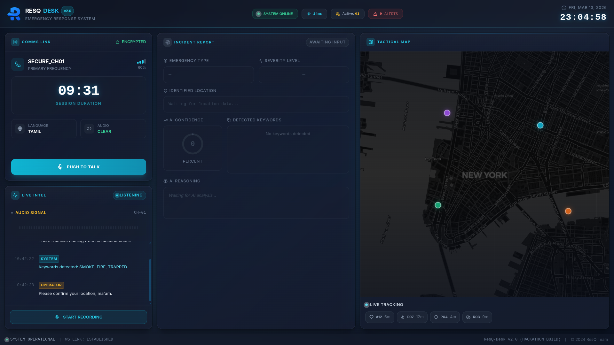
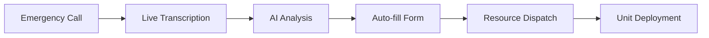

# ResQ-Desk 🚨

> **Real-time Emergency Response Management System**  
> AI-powered dispatch platform that transforms emergency calls into actionable intelligence

<div align="center">
  
  <br/>
  
  
  
  
  
</div>

---

## 🚦 Command Center

> **Backend Relay**: Meet the brains behind the UI — [ResQ-Backend](https://github.com/sanjayrohith/ResQ-Backend) keeps every call synchronized with AI intelligence.

<div align="center">
  <table>
    <tr>
      <td align="center">
        <strong>Sanjay Rohith</strong><br/>
        <a href="https://github.com/sanjayrohith">@sanjayrohith</a><br/>
        <sub>Vision & Systems</sub>
      </td>
      <td align="center">
        <strong>Sanjay E</strong><br/>
        <a href="https://github.com/sanjayy0612">@sanjayy0612</a><br/>
        <sub>Data & AI Ops</sub>
      </td>
      <td align="center">
        <strong>Abishek Raj</strong><br/>
        <a href="https://github.com/AbishekRaj2007">@AbishekRaj2007</a><br/>
        <sub>UX Flow Architect</sub>
      </td>
    </tr>
  </table>
</div>

---

## 🎯 Problem Statement

Emergency dispatchers face critical challenges:
- **Manual data entry** during high-stress calls wastes precious seconds
- **Human error** in transcription can lead to incorrect resource deployment
- **Cognitive overload** managing multiple information streams simultaneously
- **Delayed response** due to inefficient incident classification

**ResQ-Desk solves this** by automating the entire emergency intake pipeline with AI-powered real-time analysis.

---

## ✨ Core Features

### 🎙️ Live Call Management
Real-time emergency call handling with tactical controls:
- Push-to-talk (PTT) interface with operator override
- Live audio visualization and signal monitoring
- Automatic language detection (Tamil/English)
- Encrypted communication channels

### 🧠 AI-Powered Intelligence
Instant incident analysis using advanced NLP:
- **Automatic transcription** via Web Speech API
- **Smart extraction** of location, emergency type, and severity
- **Keyword detection** for rapid threat assessment
- **Confidence scoring** for decision support

### 📋 Incident Report Automation
Zero-touch form filling:
- Real-time field population as caller speaks
- Dynamic severity classification (Critical/High/Medium/Low)
- AI reasoning display for transparency
- Tactical alert flags for special conditions

### 🗺️ Interactive Tactical Map
Live resource deployment interface:
- Real-time unit tracking with ETA calculations
- Heatmap visualization of incident zones
- Route planning with distance metrics
- Multi-unit coordination (Ambulance, Fire, Police, Rescue)

---

## 🏗️ Architecture

```
┌─────────────────┐
│   Web Speech    │  ← Browser API for voice recognition
│      API        │
└────────┬────────┘
         │
         ▼
┌─────────────────┐
│  React Frontend │  ← Real-time UI with TypeScript
│   (This Repo)   │
└────────┬────────┘
         │
         ▼
┌─────────────────┐
│  AI Backend     │  ← NLP analysis & data extraction
│   (FastAPI)     │
└─────────────────┘
```

### Technology Stack

| Layer | Technology | Purpose |
|-------|-----------|---------|
| **Frontend** | React 18 + TypeScript | Type-safe component architecture |
| **Build Tool** | Vite | Lightning-fast HMR and optimized builds |
| **Styling** | Tailwind CSS + shadcn/ui | Responsive tactical UI design |
| **State** | TanStack Query | Server state synchronization |
| **Speech** | Web Speech API | Real-time voice transcription |
| **Audio** | Web Audio API | Waveform visualization |

---

## 🚀 Quick Start

### Prerequisites
- Node.js 18+ or Bun
- Modern browser (Chrome 80+, Firefox 76+, Safari 14+)
- Microphone access for speech recognition

### Installation

```bash
# Clone repository
git clone <repository-url>
cd ResQ-Desk

# Install dependencies
npm install

# Start development server
npm run dev
```

Visit `http://localhost:5173` to see the dashboard in action.

### Production Build

```bash
npm run build
npm run preview
```

---

## 📁 Project Structure

```
src/
├── components/
│   ├── dashboard/
│   │   ├── Header.tsx              # System status & navigation
│   │   ├── LiveCall.tsx            # PTT controls & call timer
│   │   ├── LiveTranscription.tsx   # Speech-to-text engine
│   │   ├── IncidentDetails.tsx     # AI-powered form automation
│   │   ├── MapPanel.tsx            # Tactical resource deployment
│   │   └── DispatchPopup.tsx       # Unit assignment modal
│   └── ui/                         # Reusable components (shadcn/ui)
├── pages/
│   └── Index.tsx                   # Main dashboard orchestration
├── hooks/                          # Custom React hooks
└── lib/                            # Utilities & configurations
```

---

## 🔄 System Workflow



1. **Call Initiated**: Operator activates PTT, caller speaks
2. **Real-time Transcription**: Speech converted to text instantly
3. **AI Processing**: Backend extracts structured data (location, type, severity)
4. **Form Auto-fill**: Incident details populate automatically
5. **Dispatch Decision**: System suggests optimal unit assignment
6. **Deployment**: Selected unit receives coordinates and ETA

---

## 🎨 UI Highlights

### Tactical Design Language
- **Dark theme** optimized for 24/7 operations
- **Color-coded severity** (Red: Critical, Amber: High, Yellow: Medium, Green: Low)
- **Real-time animations** for active states (pulsing indicators, waveforms)
- **Responsive grid** adapts to different screen sizes

### Accessibility
- High contrast ratios for readability
- Keyboard navigation support
- Screen reader compatible
- ARIA labels on interactive elements

---

## 🔌 Backend Integration

ResQ-Desk connects to an AI backend for incident analysis:

**Endpoint**: `POST http://127.0.0.1:8000/analyze`

**Request**:
```json
{
  "text": "There's a fire on the second floor of 123 Main Street"
}
```

**Response**:
```json
{
  "incident_id": "INC-2024-001",
  "location": "123 Main Street, 2nd Floor",
  "emergency_type": "FIRE",
  "severity": "Critical",
  "keywords": ["FIRE", "SMOKE", "TRAPPED"],
  "reasoning": "Multiple fire indicators detected with potential victims",
  "confidence_score": 0.94,
  "suggested_unit": "F07"
}
```

---

## 🎯 Key Innovations

1. **Zero-Touch Data Entry**: Eliminates manual typing during emergencies
2. **Operator Override**: PTT system prevents caller/operator audio conflicts
3. **Live Confidence Scoring**: Transparent AI decision-making
4. **Tactical Visualization**: Geospatial awareness for resource optimization
5. **4-Second Delay**: Gives operators time to review before dispatch popup

---

## 🛠️ Available Scripts

| Command | Description |
|---------|-------------|
| `npm run dev` | Start development server with hot reload |
| `npm run build` | Create optimized production build |
| `npm run preview` | Preview production build locally |
| `npm run lint` | Run ESLint code analysis |

---

## 🌐 Browser Compatibility

| Browser | Minimum Version | Notes |
|---------|----------------|-------|
| Chrome | 80+ | ✅ Recommended (best Web Speech API support) |
| Firefox | 76+ | ✅ Full support |
| Safari | 14+ | ⚠️ Limited Web Speech API |
| Edge | 80+ | ✅ Full support |

---

## 📊 Performance Metrics

- **Transcription Latency**: <1.5s from speech to text
- **AI Analysis Time**: ~2-3s for complete incident extraction
- **Form Auto-fill**: Instant (real-time field updates)
- **Map Rendering**: 60 FPS with live animations

---

## 🔐 Security Considerations

- Encrypted communication channels (indicated in UI)
- No persistent storage of sensitive call data
- Client-side speech processing (privacy-first)
- Secure backend API communication

---

## 🚧 Future Enhancements

- [ ] Multi-language support (expand beyond Tamil/English)
- [ ] Historical incident analytics dashboard
- [ ] Integration with CAD (Computer-Aided Dispatch) systems
- [ ] Mobile app for field units
- [ ] Voice biometrics for caller identification
- [ ] Predictive resource allocation using ML

---

## 📄 License

MIT License - see [LICENSE](LICENSE) file for details.

---

## 🤝 Contributing

This project was built for emergency services innovation. Contributions welcome!

---

<div align="center">

**Built with ❤️ for first responders**

*Saving seconds to save lives*

</div>
