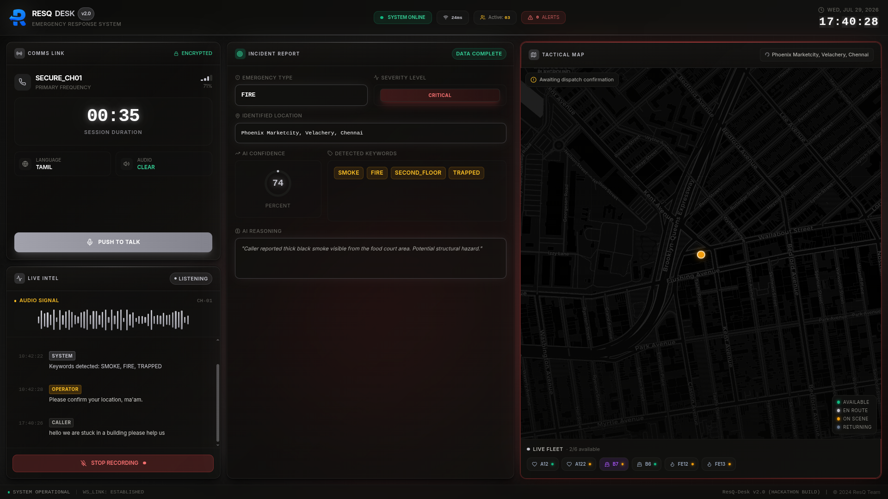
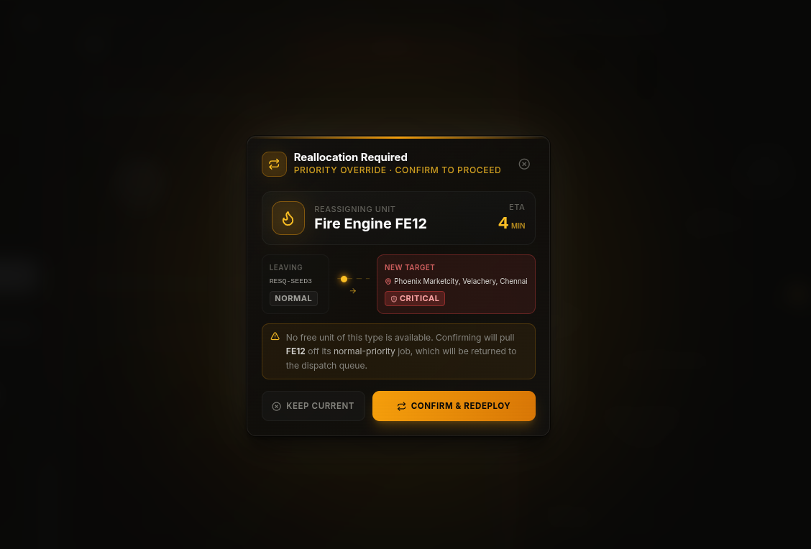

<div align="center">

# ResQ-Desk

**Real-time, AI-powered emergency response management**

A tactical dispatch platform that turns emergency calls into actionable intelligence:
live transcription, automatic incident analysis, and coordinated unit deployment.

<p>
  
  
  
  
  
</p>



</div>

---

## Overview

Emergency dispatchers work under extreme pressure, where manual data entry, human
error, and cognitive overload can cost critical seconds. ResQ-Desk removes the manual
steps: it transcribes the caller in real time, uses AI to extract structured incident
data, and recommends the optimal response unit — reducing the time from call to
dispatch from tens of seconds to a few seconds.

This repository contains the **frontend** (React tactical dashboard). The AI engine and
command center live in the companion backend repository.

| Component | Repository | Stack |
| --------- | ---------- | ----- |
| Frontend (this repo) | [ResQ-Desk](https://github.com/sanjayrohith/ResQ-Desk) | React, TypeScript, Vite |
| Backend | [ResQ-Backend](https://github.com/sanjayrohith/ResQ-Backend) | FastAPI, AI/NLP, Python |

---

## Features

| Live Call Management | AI Intelligence | Automated Reports | Tactical Maps |
| -------------------- | --------------- | ----------------- | ------------- |
| Push-to-talk interface | Real-time NLP analysis | Zero-touch form filling | Live unit tracking |
| Audio visualization | Smart data extraction | Severity classification | Auto-reallocation |
| Language detection | Keyword detection | AI reasoning display | Multi-unit coordination |
| Encrypted channels | Confidence scoring | Tactical alerts | ETA calculations |

### AI-Powered Intelligence

A transcript such as *"There's a fire on the second floor..."* is analyzed instantly into
structured fields:

| Field | Extracted Value | Confidence |
| ----- | --------------- | ---------- |
| Location | 123 Main Street, 2nd Floor | 94% |
| Type | FIRE | 98% |
| Severity | Critical | 91% |
| Keywords | FIRE, SMOKE, TRAPPED | — |

### Live Unit Tracking & Auto-Reallocation

Every unit carries a live lifecycle status that updates on the tactical map in real time:

| Status | Meaning | Marker |
| ------ | ------- | ------ |
| AVAILABLE | Idle, ready to dispatch | Green |
| EN ROUTE | Assigned, travelling to the incident | Platinum (pulsing) |
| ON SCENE | Arrived, working the incident | Amber |
| RETURNING | Job done, heading back to base | Slate |

```
AVAILABLE  ->  EN ROUTE  ->  ON SCENE  ->  RETURNING  ->  AVAILABLE
```

When a Critical incident arrives and every capable unit is busy, the orchestrator does
not simply report "none available" — it finds a unit on a lower-priority job and proposes
pulling it off. The dispatcher gets a one-click confirmation, and the reassigned unit
immediately begins moving toward the new scene on the map.

<div align="center">



</div>

### Intelligent Map

The map is the spatial source of truth, wired to real data rather than placeholders:

- **Real geocoding** — the AI-extracted location is resolved to actual coordinates, so
  the incident marker lands on the real address.
- **Distance-aware placement** — units are positioned around the incident by their real
  `distance_km`.
- **Live routes** — dispatched units draw an animated route line and travel along it
  toward the scene in real time.
- **Auto-framing and click-to-locate** — the camera auto-fits the incident and its
  responders; click any unit to fly straight to it.
- **Dispatch overlay** — a live summary (e.g. `FE12 inbound · 4 min · 2.3 km`) plus a
  status legend keep the tactical picture readable at a glance.

---

## Architecture

```
    Web Speech API  ->  React UI (this repo)  ->  AI Backend (FastAPI)
         |                     |                          |
         v                     v                          v
    Voice -> Text         Tactical UI              NLP Analysis
    Recognition           Live Dashboard           Data Extraction
```

### Tech Stack

| Layer | Technology |
| ----- | ---------- |
| UI Framework | React 18 |
| Language | TypeScript |
| Build Tool | Vite |
| Styling | Tailwind CSS |
| Components | shadcn/ui |
| Server State | TanStack Query |
| Maps | Leaflet / react-leaflet |
| Speech | react-speech-recognition |

---

## Design Language

A premium, blacked-out command-center aesthetic, built to feel calm under pressure.

| Element | Treatment |
| ------- | --------- |
| Palette | Deep matte black with a refined platinum accent; colour is reserved for meaning |
| Semantic colour | Red = Critical, Amber = High, Emerald = Available — the only saturated tones on screen |
| Micro-interactions | Count-up confidence and ETA, an odometer-style rolling clock, staggered panel entrances |
| Ambience | Slow-drifting aurora glow, a living tactical grid, and glassmorphic panels |
| Reallocation flow | An animated transfer view showing a unit move from its old job to the new critical scene |

---

## Getting Started

See [SETUP.md](SETUP.md) for full installation and run instructions.

---

## How It Works

| Step | Action | Time |
| ---- | ------ | ---- |
| 1 | Call initiated — operator activates PTT, caller speaks | 0s |
| 2 | Real-time transcription — speech converted instantly | <1.5s |
| 3 | AI processing — backend extracts location, type, severity | ~2-3s |
| 4 | Form auto-fill — incident details populate automatically | instant |
| 5 | Dispatch decision — system suggests the optimal unit | ready |
| 6 | Unit deployment — responders receive coordinates and ETA | — |

---

## API Integration

### Analyze a Transcript

```
POST http://127.0.0.1:8000/analyze
```

Request:

```json
{
  "text": "There's a fire on the second floor of 123 Main Street"
}
```

Response:

```json
{
  "incident_id": "INC-2024-001",
  "location": "123 Main Street, 2nd Floor",
  "emergency_type": "FIRE",
  "severity": "Critical",
  "keywords": ["FIRE", "SMOKE", "TRAPPED"],
  "reasoning": "Multiple fire indicators detected with potential victims",
  "confidence_score": 0.94,
  "suggested_unit": "F07",
  "reallocation": null
}
```

### Live Unit Tracking & Reallocation

```
GET  http://127.0.0.1:8000/units                 # Live state of every unit
POST http://127.0.0.1:8000/units/{id}/status     # Advance lifecycle status
POST http://127.0.0.1:8000/units/reallocate      # Confirm a reallocation
POST http://127.0.0.1:8000/units/reset           # Reset the sim roster
```

Live unit state (`GET /units`):

```json
[
  {
    "unit_id": "Fire Engine FE12",
    "vehicle_type": "FIRE_ENGINE",
    "lat": 40.7201,
    "lng": -73.996,
    "distance_km": 2.3,
    "eta_minutes": 4,
    "status": "ON_SCENE",
    "assigned_incident": "RESQ-SEED3",
    "assigned_severity": "Normal"
  }
]
```

When no unit is free, `/analyze` returns a `reallocation` block instead of `null`:

```json
{
  "reallocation": {
    "unit_id": "Fire Engine FE12",
    "from_incident": "RESQ-SEED3",
    "from_severity": "Normal",
    "to_severity": "Critical",
    "eta_minutes": 4,
    "message": "No Fire Engine available. FE12 is on a Normal-priority job and can be reallocated to this Critical incident (4 mins ETA)."
  }
}
```

Confirm a reallocation (`POST /units/reallocate`):

```json
{
  "unit_id": "Fire Engine FE12",
  "incident_id": "RESQ-A1B2",
  "severity": "Critical"
}
```

---

## Project Structure

```
ResQ-Desk/
├── frontend/
│   └── src/
│       ├── components/
│       │   ├── dashboard/           # Domain components
│       │   │   ├── Header.tsx           # System status & nav
│       │   │   ├── LiveCall.tsx         # PTT controls & timer
│       │   │   ├── LiveTranscription.tsx # Speech-to-text engine
│       │   │   ├── IncidentDetails.tsx  # AI form automation
│       │   │   ├── MapPanel.tsx         # Tactical deployment
│       │   │   └── DispatchPopup.tsx    # Unit assignment
│       │   └── ui/                  # shadcn/ui components
│       ├── pages/Index.tsx          # Main orchestration
│       ├── hooks/                   # Custom React hooks
│       └── lib/                     # Utilities
└── backend/                         # AI engine & command center
```

---

## Performance

| Metric | Value |
| ------ | ----- |
| Transcription latency | <1.5s |
| AI analysis time | ~2-3s |
| Form auto-fill | Instant |
| Map rendering | 60 FPS |

---

## Browser Support

| Browser | Version | Notes |
| ------- | ------- | ----- |
| Chrome | 80+ | Recommended |
| Firefox | 76+ | Full support |
| Edge | 80+ | Full support |
| Safari | 14+ | Limited Speech API |

---

## Security

- Encrypted channels — all communications secured
- No persistent storage — sensitive call data is not stored
- Client-side processing — privacy-first voice handling
- Secure API — protected backend communication

---

## Roadmap

**Completed**

- Real-time transcription
- AI incident analysis
- Auto-form filling
- Tactical map
- Unit dispatch
- Live unit tracking
- Auto-reallocation
- Geocoded live routing
- Premium black UI

**Planned**

- Multi-language support
- Analytics dashboard
- CAD integration
- Mobile app
- Voice biometrics
- Predictive ML

---

## Contributing

Contributions are welcome. Please open an
[issue](https://github.com/sanjayrohith/ResQ-Desk/issues) to report a bug or request a
feature.

---

## Team

| Name | Role | GitHub |
| ---- | ---- | ------ |
| Sanjay Rohith | Lead Developer | [@sanjayrohith](https://github.com/sanjayrohith) |
| Sanjay E | AI & Backend | [@sanjayy0612](https://github.com/sanjayy0612) |
| Abishek Raj | Frontend Architect | [@AbishekRaj2007](https://github.com/AbishekRaj2007) |

---

## License

Released under the MIT License. See [LICENSE](LICENSE) for details.
